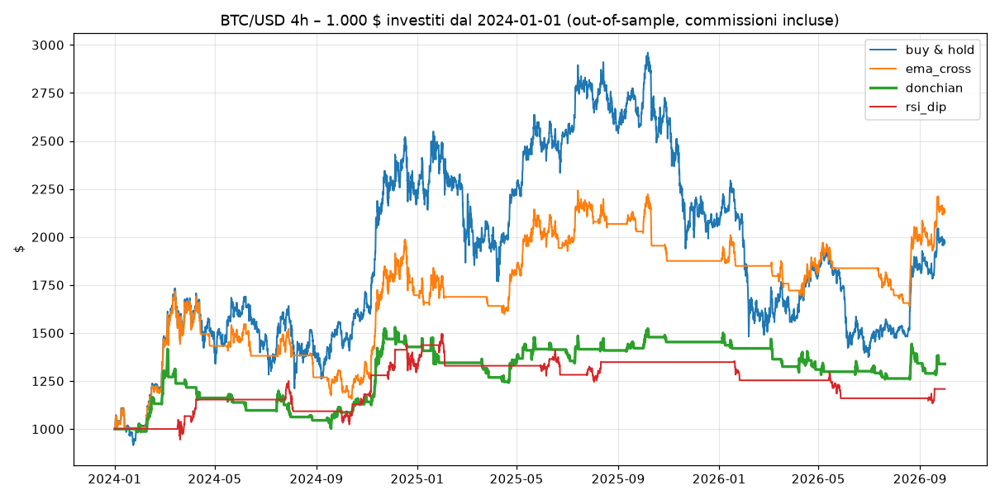

# Risultati backtest BTC/USD (4h)

Commissioni 0,10% + slippage 0,05% per lato. Operazione alla candela successiva al segnale.

## 1. Ottimizzazione – in-sample (01/01/2018 → 01/01/2024)
| strategia | parametri | rendimento % | CAGR % | max drawdown % | Sharpe | trade | liquidato |
|---|---|---|---|---|---|---|---|
| buy & hold | - | 222.3 | 21.5 | -81.7 | 0.63 | 0 | no |
| ema_cross | fast=10, slow=200 | 952.7 | 48.0 | -53.7 | 1.08 | 65 | no |
| donchian | entry=55, exit=10 | 810.5 | 44.5 | -32.4 | 1.25 | 96 | no |
| rsi_dip | buy=35, sell=70, trend=200 | 72.7 | 9.5 | -33.6 | 0.51 | 33 | no |

## 2. Verifica – out-of-sample (01/01/2024 → 01/10/2026), stessi parametri, nessun ritocco
| strategia | parametri | rendimento % | CAGR % | max drawdown % | Sharpe | trade | liquidato |
|---|---|---|---|---|---|---|---|
| buy & hold | - | 97.0 | 27.9 | -53.6 | 0.76 | 0 | no |
| ema_cross | fast=10, slow=200 | 113.1 | 31.6 | -32.6 | 1.03 | 34 | no |
| donchian | entry=55, exit=10 | 33.9 | 11.2 | -29.2 | 0.6 | 53 | no |
| rsi_dip | buy=35, sell=70, trend=200 | 20.8 | 7.1 | -24.2 | 0.48 | 15 | no |

## 3. Strategia scelta (donchian) con leva – out-of-sample
Funding 0,01%/8h, liquidazione se il minimo della candela brucia il margine.

| leva | rendimento % | CAGR % | max drawdown % | Sharpe | trade | liquidato |
|---|---|---|---|---|---|---|
| 1x | 33.9 | 11.2 | -29.2 | 0.6 | 53 | no |
| 3x | 32.3 | 10.7 | -68.4 | 0.48 | 53 | no |
| 10x | -100.0 | -100.0 | -100.0 | n/d | 53 | SÌ (05/03/2024) |
| 20x | -100.0 | -100.0 | -100.0 | n/d | 53 | SÌ (05/03/2024) |
